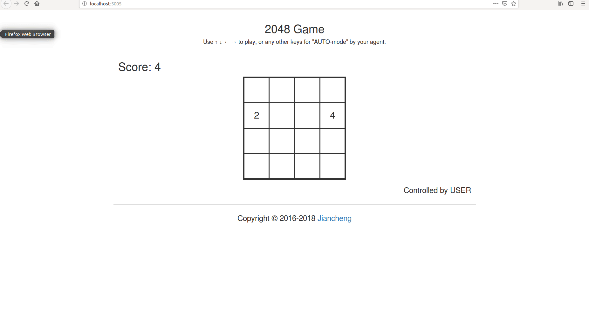

# 2048-api
A 2048 game api for training supervised learning (imitation learning) or reinforcement learning agents

# Code structure
* [`game2048/`](game2048/): the main package.
    * [`game.py`](game2048/game.py): the core 2048 `Game` class.
    * [`agents.py`](game2048/agents.py): the `Agent` class with instances.
    * [`displays.py`](game2048/displays.py): the `Display` class with instances, to show the `Game` state.
    * [`myRNN.py/`](game2048/myRNN.py): a RNN agent with class RNN and the training function. 
    * [`myPlanning.py/`](game2048/myRNN.py): a planning agent with  class MyPlanning.    
    * [`expectimax/`](game2048/expectimax): a powerful ExpectiMax agent by [here](https://github.com/nneonneo/2048-ai).
* [`explore.ipynb`](explore.ipynb): introduce how to use the `Agent`, `Display` and `Game`.
* [`static/`](static/): frontend assets (based on Vue.js) for web app.
* [`webapp.py`](webapp.py): run the web app (backend) demo.
* [`evaluate.py`](evaluate.py): evaluate your self-defined agent.

# Environment
* code only tested on linux system (ubuntu 16.04)
* Python 3 (Anaconda 3.6.6 ) with numpy and flask
* Backages contain numpy=1.15.4, flask, pytorch=0.4.1, torchvision=0.2.1, pandas=0.20.3.
# To get train dataset
In evalute.py:
```python
...
GAME_SIZE = 4
WRITEFILE = 'game2048/DATA.csv'
LB = 0
HB = 2048
...
from game2048.agents import getBoardFormExpect as TestAgent

scores = []
for _ in range(N_TESTS):
    # score = single_run(GAME_SIZE, SCORE_TO_WIN,
    #                    AgentClass=TestAgent)
    score = single_run_getdata(GAME_SIZE, WRITEFILE, LB, HB,
                       AgentClass=TestAgent)
    scores.append(score)
    # print(scores)
print("Average scores: @%s times" % N_TESTS, sum(scores) / len(scores))

```
run
```bash
python evalute.py
```
# To train the rnn model
```bash
cd game2048/
python myRNN.py
```
# To test the rnn model
In evalute.py:
```python
...
GAME_SIZE = 4
SCORE_TO_WIN = 2048
N_TESTS = 50
...
from game2048.agents import MyRnnAgent as TestAgent

scores = []
for _ in range(N_TESTS):
    score = single_run(GAME_SIZE, SCORE_TO_WIN,
                       AgentClass=TestAgent)
    # score = single_run_getdata(GAME_SIZE, WRITEFILE, LB, HB,
    #                    AgentClass=TestAgent)
    scores.append(score)
    # print(scores)
print("Average scores: @%s times" % N_TESTS, sum(scores) / len(scores))

```
run
```bash
python evalute.py
```
# To test the planning agent
In evalute.py:
```python
...
GAME_SIZE = 4
SCORE_TO_WIN = 2048
N_TESTS = 50
...
from game2048.agents import MyPlanningAgent as TestAgent

scores = []
for _ in range(N_TESTS):
    score = single_run(GAME_SIZE, SCORE_TO_WIN,
                       AgentClass=TestAgent)
    # score = single_run_getdata(GAME_SIZE, WRITEFILE, LB, HB,
    #                    AgentClass=TestAgent)
    scores.append(score)
    # print(scores)
print("Average scores: @%s times" % N_TESTS, sum(scores) / len(scores))

```
run
```bash
python evalute.py
```
# To get boards of rnn agent 
In evalute.py:
```python
...
GAME_SIZE = 4
WRITEFILE = 'game2048/DATA.csv'
LB = 0
HB = 2048
...
from game2048.agents import getBoardFromMyRnnAgent as TestAgent

scores = []
for _ in range(N_TESTS):
    # score = single_run(GAME_SIZE, SCORE_TO_WIN,
    #                    AgentClass=TestAgent)
    score = single_run_getdata(GAME_SIZE, WRITEFILE, LB, HB,
                       AgentClass=TestAgent)
    scores.append(score)
    # print(scores)
print("Average scores: @%s times" % N_TESTS, sum(scores) / len(scores))

```
run
```bash
python evalute.py
```
# To run the web app
```bash
python webapp.py
```


# LICENSE
The code is under Apache-2.0 License.

